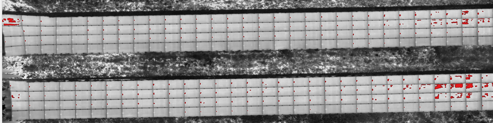
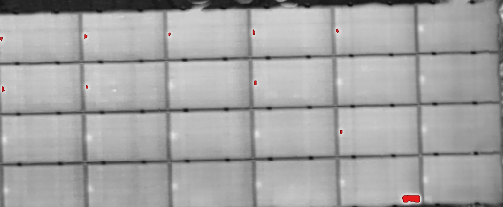
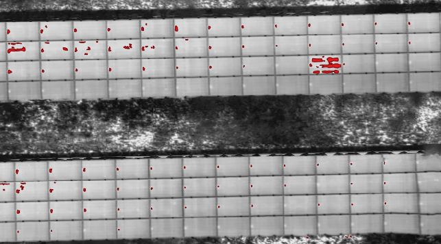

# Geo-Referenced Solar Panel Hotspot Detection

This project is a data processing pipeline for the automatic detection of defective/overheating panels (hotspots) in solar power plants (PV systems) using thermal drone imagery, with direct integration into Geographic Information Systems (GIS/QGIS).

## Project Structure

| Folder / File      | Description                                                                              |
| ------------------ | ---------------------------------------------------------------------------------------- |
| `data/input/`      | `odm_orthophoto.tif` and `panels.geojson` are placed here. (Ignored by Git)              |
| `data/output/`     | The generated `fault_analysis_result.png` and `detected_faults.geojson` are saved here.  |
| `src/main.py`      | The complete analysis script.                                                            |
| `requirements.txt` | Project dependencies.                                                                    |
| `.gitignore`       | Prevents uploading large map files to the repository.                                    |
| `README.md`        | Documentation of the project's logic and architecture.                                   |

## 🚀 Project Journey and Architectural Decisions

During development, two different approaches were tested:

1. **Raw Image Processing:** Processing 120 raw photos straight from the drone and marking faults on them individually.
2. **Processing via Orthomosaic:** Stitching the photos first using OpenDroneMap (ODM) and analyzing the resulting map (`.tif`).

**Why the 2nd method?** If detection ran on raw photos and red markers were drawn on them before photogrammetry (map stitching), the feature matching algorithms would fail: the software would interpret the drawn red boxes as physical objects in the field, causing "ghosting" effects and tears during map generation. The project therefore follows a **"stitch first, analyze later"** principle, which keeps the precise WGS84 GPS coordinates of the detected faults intact.

## 🧠 How the Algorithm Works (Under the Hood)

The system operates in 3 main stages inside `src/main.py`:

### 1. Geographic Masking

The thermal map (`odm_orthophoto.tif`) contains many non-analytical areas such as soil, grass, or roads. Using `rasterio` and `geopandas`, the site's `panels.geojson` data is overlaid onto the map. The map is then cropped exactly to the coordinates where panels exist, zeroing out background noise.

### 2. Dynamic Percentile-Based Thresholding

The original dataset consists of Radiometric JPGs (R-JPG) where raw temperature data is embedded in the metadata (extracted by the dataset author using the `Flyr` library). However, when these images are stitched with standard photogrammetry settings in OpenDroneMap (ODM), the output orthomosaic (`odm_orthophoto.tif`) is a visual 3-channel RGB map: the raw radiometric metadata is lost.

To work around this limitation and avoid the pitfalls of a fixed brightness threshold (which can be misleading due to sun glare or cloud coverage), the code uses a dynamic approach:

- The RGB image is converted into an 8-bit single-channel grayscale (relative temperature map) using `OpenCV`.
- Using `numpy.percentile`, only the **brightest (hottest) 1%** of the masked panel pixels is classified as a fault.
- The threshold value therefore self-adjusts to the weather conditions of the day and the overall temperature of the map.

### 3. Vectorization and QGIS Integration

The boundaries of the detected pixels are extracted with `cv2.findContours`. Any shape smaller than 5 pixels is treated as noise and eliminated. The pixel coordinates of the remaining hotspots are converted back to real-world GPS coordinates using `rasterio.transform`, and the results are exported as `Shapely` polygons into a `.geojson` file.

**Visualization:** The generated `.geojson` is added as a separate layer on top of the original `.tif` map in QGIS, so defective panels appear directly on the real-world map as **red polygons**.

## 📊 Results and Honest Analysis

The pipeline was run on a real thermal orthomosaic and the detections were reviewed in QGIS. The output confirms both the strengths and the predicted weaknesses of the percentile-based approach:


*Detections across full panel rows. Note the dense clusters concentrated on the right side of the map.*


*Close-up: one detection per panel at nearly identical positions — the signature of junction boxes, not random defects.*


*An irregular multi-cell cluster (center-right) standing out from the regular pattern — the strongest candidate for a genuine fault.*

**1. Systematic false positives from junction boxes.** The majority of detections form a strikingly regular pattern: one small red spot per panel, at roughly the same position on each module, repeating across entire rows. Genuine cell defects do not distribute themselves in a grid. This regularity is strong evidence that the algorithm is detecting **junction boxes and bypass diodes**, components that run hotter than the surrounding cells by design. The detector is working exactly as specified (it finds the hottest 1%), but "hottest" and "defective" are not the same thing.

**2. Clustered detections at the map edges.** Dense, irregular red clusters appear concentrated on one side of the orthomosaic. Two explanations are plausible and cannot be separated with brightness alone: either this section of the plant genuinely runs hot (a possible string-level issue worth a field inspection), or it is **sun glare**. Glare tends to concentrate in one region of the map because the sun-panel-camera geometry only hits the critical reflection angle over part of the flight path.

**3. Isolated multi-cell clusters.** A small number of detections show several adjacent cells lighting up together in an irregular shape. These are the most promising candidates for real hotspots (e.g., a bypass diode activating over a substring) and are the detections that justify a physical inspection.

**The core takeaway:** classical thresholding answers *"where is it hot?"* very reliably, but it cannot answer *"why is it hot?"*. Brightness alone cannot distinguish a defective cell from a junction box or a reflection, because all three look identical in a single grayscale value.

## 🔮 Future Work: From Thresholding to Learned Detection

The failure modes above are not random noise; they have **visual structure** that a learned model can exploit:

- Junction boxes appear at fixed relative positions within a module and have a consistent size and shape.
- Sun glare produces large, diffuse, soft-edged blobs, while real hotspots are compact with sharper thermal gradients.
- Real defects correlate with cell-grid geometry (single cell, substring, or full-panel patterns).

This makes the problem well suited to an object detection model such as **YOLO** (or a segmentation model like U-Net), trained on the current pipeline's outputs after manual labeling in QGIS. The existing system is not wasted work in that scenario — it becomes the **candidate generator and labeling accelerator**: instead of scanning the entire orthomosaic by hand, the operator only classifies the regions this detector already found ("real fault" / "junction box" / "glare"). Those labels are exactly the training data a supervised model needs.

Planned improvements, in rough order of impact:

1. **Manual labeling of current detections** in QGIS to build a small ground-truth dataset.
2. **Geometric filtering** as a cheap intermediate step: suppress detections that repeat at the same relative position across many panels (junction-box pattern) before any deep learning is involved.
3. **YOLO-based classification** of candidate regions to separate true hotspots from glare and electronics.
4. **Radiometric pipeline**: re-stitching the original R-JPGs with radiometric settings preserved would replace relative brightness with actual temperature values, making absolute thresholds (e.g., "ΔT > 15 °C vs. panel mean") possible.

## ⚠️ Known Limitations

The algorithm detects the top 1% brightest percentile. Due to thermal dynamics, it may generate **false positive** detections in the following cases:

- **Junction Boxes and Diodes:** Components behind the panels that run hotter than normal cells by design may be flagged as faults.
- **Sun Glare:** Large glares on the panel surface, caused by the drone's angle, can exceed the threshold value.
- **Metal Frames:** The different heating/reflection behavior of aluminum/metal frames at connection joints can be detected as thin, long lines.

*These limitations are currently tolerated so that the operator can visually verify the outputs in QGIS.*

## 💻 Installation

**1. Clone the repository and install requirements:**

```bash
git clone https://github.com/emrecan-oz/solar-panel-hotspot-detector.git
cd solar-panel-hotspot-detector
pip install -r requirements.txt
```

## Usage

**1. Prepare your data:**

- Place `odm_orthophoto.tif` and `panels.geojson` inside the `data/input/` folder. The script reads them from there automatically; no paths need to be edited.
- Make sure both files share the same Coordinate Reference System (CRS). If they differ, the script reprojects the GeoJSON to the map's CRS.

**2. Run the script (from the project root):**

```bash
python src/main.py
```

**3. Review the results:**

The outputs are written to `data/output/`:

- `fault_analysis_result.png` — a black-and-white mask showing what the system detected.
- `detected_faults.geojson` — the georeferenced fault polygons.

Open QGIS and drag your original `.tif` map into the project, then drag `detected_faults.geojson` on top of it. Color the GeoJSON layer red in the layer settings to see the exact fault locations on the map.
